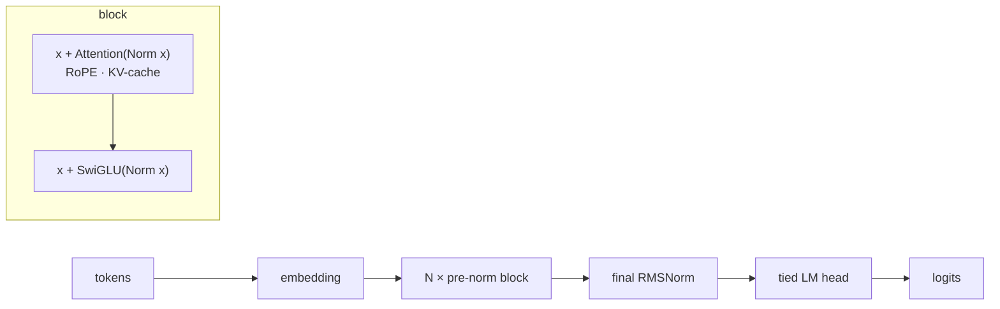

<div align="center">

# 🧠 NanoGPT-Lab

**A Llama-style, decoder-only transformer built from the attention up — RoPE · RMSNorm · SwiGLU · weight tying · KV-cache. No `nn.Transformer`.**

[](https://github.com/USER/nanogpt-lab/actions/workflows/ci.yml)
[](https://www.python.org/downloads/)
[](https://pytorch.org/)
[](https://github.com/psf/black)
[](LICENSE)

</div>

> **The wow:** every modern component is implemented by hand *and* toggled by config, so an **ablation study measures what each one is worth** — and a single test proves the **KV-cache decode is bit-for-bit identical to a full forward pass** (the bug that usually ships silently). Depth you can defend on a whiteboard, not library calls.

---

## Why this is more than "another nanoGPT"

- **Modern architecture, from scratch.** Rotary embeddings, RMSNorm, and a SwiGLU MLP — the Llama recipe — each written directly and unit-tested (`test_rope.py` checks the norm-preserving *and* relative-position properties).
- **A correctness test that actually bites.** `test_kv_cache.py` asserts cached incremental decoding equals a full forward to `1e-4`, **across all five architecture variants**. Get a RoPE offset or the cache mask wrong and it fails.
- **An honest ablation.** The same code trains RoPE-vs-learned, RMSNorm-vs-LayerNorm, SwiGLU-vs-GELU on identical data/seed and reports Δ validation loss *with parameter counts*.
- **Runs anywhere.** The default config trains a ~1M-param model on **CPU in minutes** (this repo's reproducible smoke run); the `full` config scales to a GPU with one flag.
- **Typed, tested, containerized, CI-green.** `mypy`, `ruff`, `black`, 26 tests, a lean CPU Docker image.

## Architecture



See **[ARCHITECTURE.md](ARCHITECTURE.md)** for the reasoning behind each choice.

## Results — real, measured numbers

A **1.06M-parameter** character-level model (4 layers, 4 heads, d=128, block=128,
65-char vocab) trained on Tiny Shakespeare, **on CPU**, for 2,000 iterations
(~40 min of compute). Random baseline for a 65-symbol vocab is **log₂(65) ≈ 6.02 bits/char**.

| | Validation |
|---|---:|
| Cross-entropy loss | **1.506** |
| Bits per character | **2.17** (vs 6.02 random) |
| Perplexity | 4.51 |

### Sample (temperature 0.8)

```text
May the earth of never thing this time field
Metch'd discover'd case, and I will glad by his mother,
and citizens of damnawful thought only they do here?

Nurse:
Well, do you tell thee with his father's love.
Died all my heart way, but one Nepture thee,
From my party begin in judgment remains
That p
```

Character cues (`Nurse:`), dialogue, and archaic diction — learned character-level
from 1 MB of text by a 1M-parameter model. Not coherent English (it's tiny), but
unmistakably Shakespearean in shape.

### Ablation — what each modern component is worth

Each variant trained identically (300 iters, same seed/data) on a smaller/faster
model; lower validation loss is better. *(Directional study — the absolute loss is
higher than the headline model because the ablation model is smaller.)*

| Variant | Val loss | Bits/char | Params | Δ loss vs baseline |
|---|---:|---:|---:|---:|
| **Baseline** — RoPE + RMSNorm + SwiGLU | **2.045** | 2.95 | 449,280 | — |
| Learned positions (no RoPE) | 2.354 | 3.40 | 449,280 | **+0.309** |
| LayerNorm (no RMSNorm) | 2.046 | 2.95 | 449,952 | +0.001 |
| GELU MLP (no SwiGLU) | 2.151 | 3.10 | 340,128 | +0.106 |

**What it says — read honestly:**
- **RoPE earns its place decisively.** Swapping it for learned absolute positions costs **+0.31 loss** — by far the largest gap.
- **RMSNorm ≈ LayerNorm in quality here** (+0.001, within noise) — but with fewer parameters and less compute, so it's the right *default*, not an accuracy win.
- **SwiGLU beats GELU by +0.11** — but note it also carries ~109k more parameters (3 projections vs 2), so part of the gain is capacity. The params column keeps that honest.

## Quickstart

No Python on your machine? **Everything runs in Docker.**

```bash
# Train the smoke model on CPU (downloads + verifies data), then sample:
docker build -t nanogpt-lab .
docker run --rm -v "$PWD":/app nanogpt-lab python -m nanogpt_lab.train --config config/smoke.yaml
docker run --rm -v "$PWD":/app nanogpt-lab python -m nanogpt_lab.model.generate --prompt "ROMEO:"
```

With Python 3.12:

```bash
make setup
make train                 # CPU smoke run on Tiny Shakespeare
make generate              # sample from the checkpoint
make ablate                # run the ablation study
make train CONFIG=config/full.yaml   # ~25M params on TinyStories (needs a GPU)
```

### Interactive demo

`app.py` is a Gradio UI (prompt + temperature/top-k) deployable to Hugging Face
Spaces:

```bash
pip install -r requirements-demo.txt
python app.py     # http://localhost:7860
```

## Project layout

```
src/nanogpt_lab/
  config.py            typed config (pydantic)
  data/                char tokenizer + corpus download/split
  model/
    rope.py            rotary embeddings (from scratch)
    layers.py          RMSNorm, SwiGLU, GELU MLP
    attention.py       causal self-attention + KV cache
    transformer.py     the GPT model
    generate.py        sampling + cached incremental decode
  evaluate.py          batching, loss, bits-per-char, perplexity
  train.py             AdamW + cosine LR loop, checkpointing
  ablation.py          the architecture ablation study
tests/                 26 tests incl. KV-cache equivalence & overfit-a-batch
app.py                 Gradio demo (Hugging Face Spaces)
```

## Tech stack

Python 3.12 · PyTorch 2.12 (CPU) · Pydantic v2 · structlog · pytest · Docker · GitHub Actions · Gradio

## Data & license

Tiny Shakespeare (public domain), via Karpathy's char-rnn repo; the loader pins its
SHA-256. TinyStories (Eldan & Li, 2023) for the GPU config. Code under the [MIT License](LICENSE).
